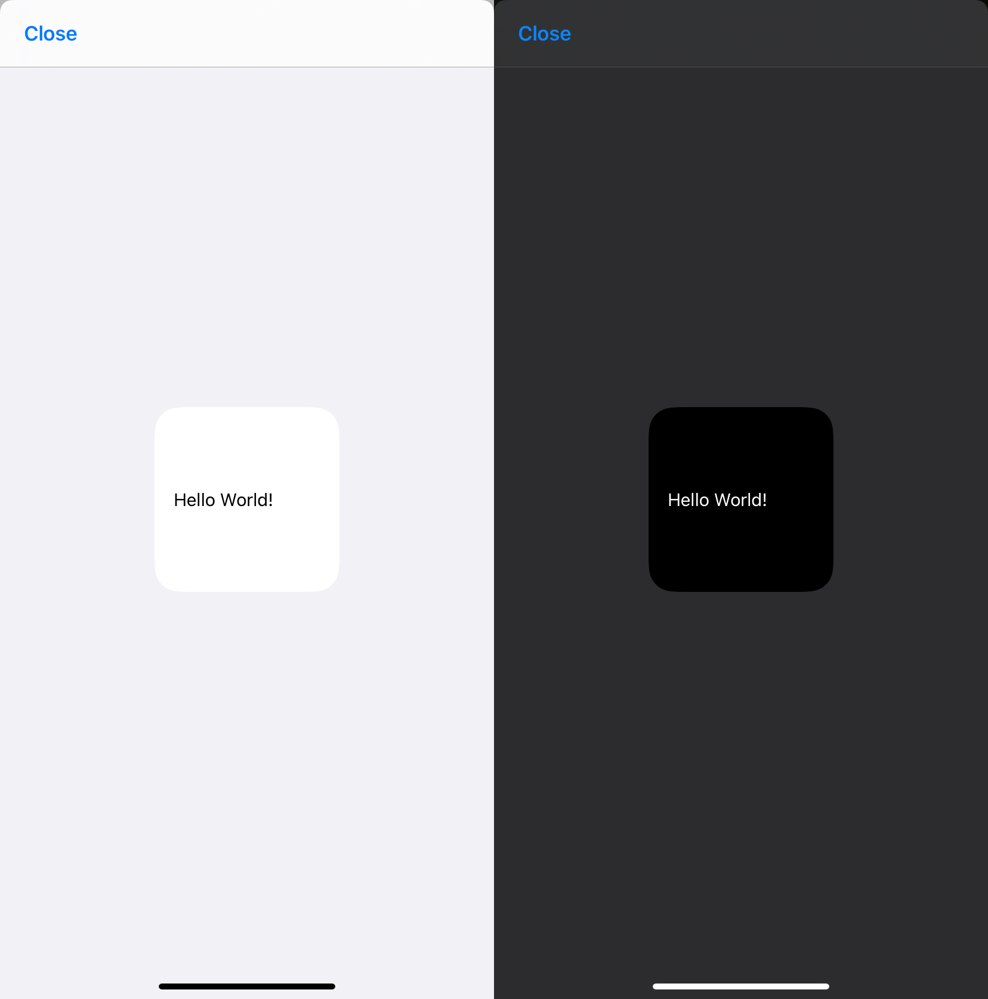

import useBaseUrl from '@docusaurus/useBaseUrl';

**This page is a WIP, come back later when we have some idea of what to put here.**

## How To Add Text To A Widget

#### Intro
When starting a widget that you would like to display text on it often comes up that the script writer doesn't know how or where to place a given set of text to display. 

There are a number of different ways we have to display text in a widget. The main ways to display text are as:
- WidgetText (using addText)
- Stack (using addText within a stack)
- DrawContext

#### Using WidgetText
  Let's cover the basic idea of how to add text to a widget. This code snippet is the minimal level needed to display basic text in a widget.

In the below example code, you can see that we first inialize the widget using `let w = new ListWidget()`, this assigns the variable w as our widget. 
Next, we add the text as explained in the API documentation within the app, using the ListWidget.addText method. However, if you notice the `let text = w.addText('Hello World')`, we first assign the addText item to the variable `text`. The reason we do this, is because it allows us to modify the text characteristics (size, color, font, etc.). We will get to this later. 

At the end of the script, it's always a good idea to set the widget, this will allow the widget to be displayed. 

Following setting the widget, we call `Script.complete()` to tell the app the script is finished.

This is all that is needed at this point for the widget to work on the Home Screen, however, usually developers of widgets like to see a preview, for this reason, it's a good idea to use `w.presentLarge()`, `w.presentMedium()`, or `w.presentSmall()` depending on the size you are trying to preview. `w` is purely based on the variable we set at the beginning of the script, so if this was setup to be something other than how it shows in the example, you'll need to use that instead. 
 
  ##### Example Code
  ```javascript
  let w = new ListWidget()

  let text = w.addText('Hello World!')

  Script.setWidget(w)
  Script.complete()

  w.presentSmall()
  ```
This widget turns out like this depending on light / dark mode:
  

